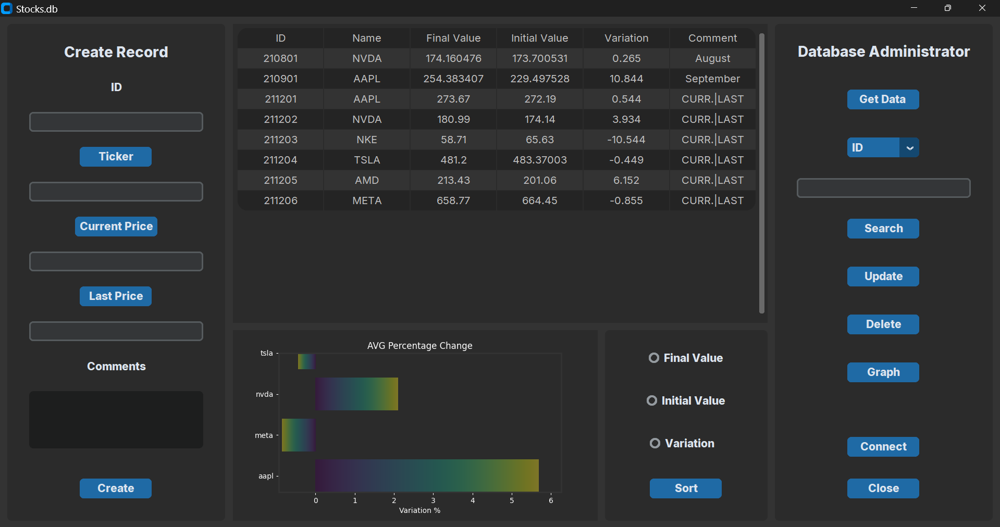
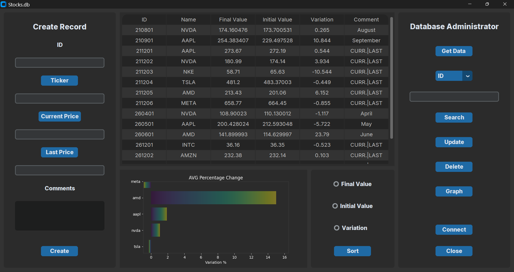
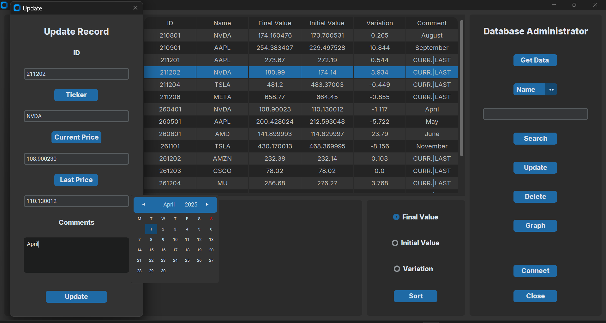
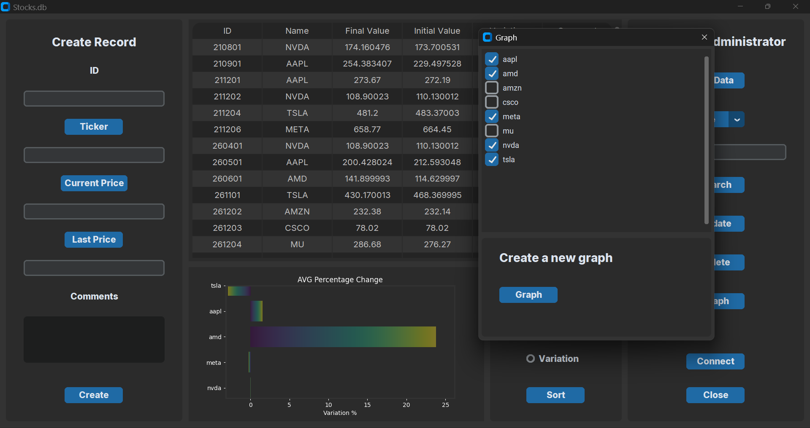
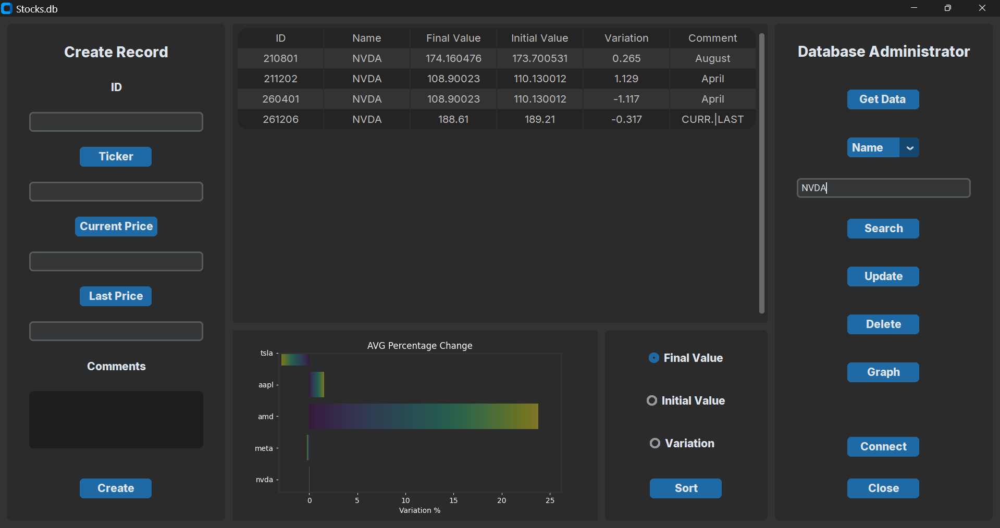
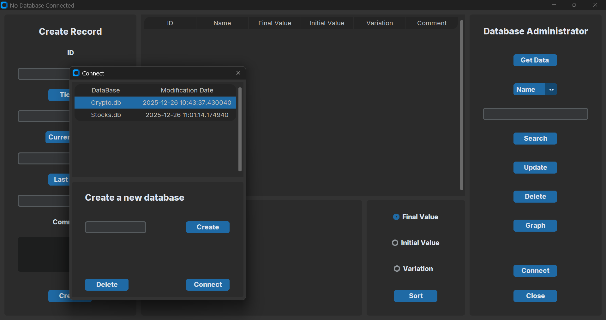
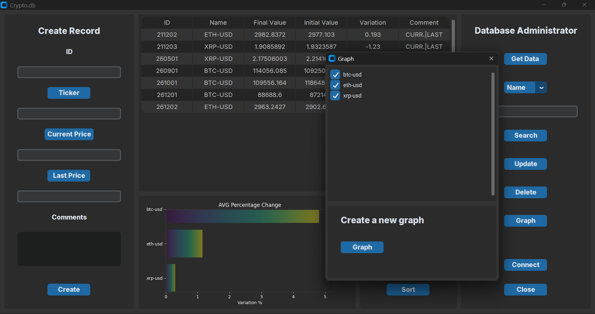

<b>App_Data</b> is a desktop application designed to manage and analyze stock market data using a relational database. It stores historical price information for financial assets, including identifiers, names, initial and final prices, and user-defined comments.

The application automatically calculates the percentage price variation for each asset and visualizes the average variation through graphical charts.

The system follows the CRUD paradigm for database operations and integrates an external API to retrieve market data in real time or for a user-selected date.

  

  

  

  

  

  

  

The graphical user interface is developed using the CustomTkinter library, complemented by CTkTable and CTkTableRowSelector for enhanced data visualization and interaction.
